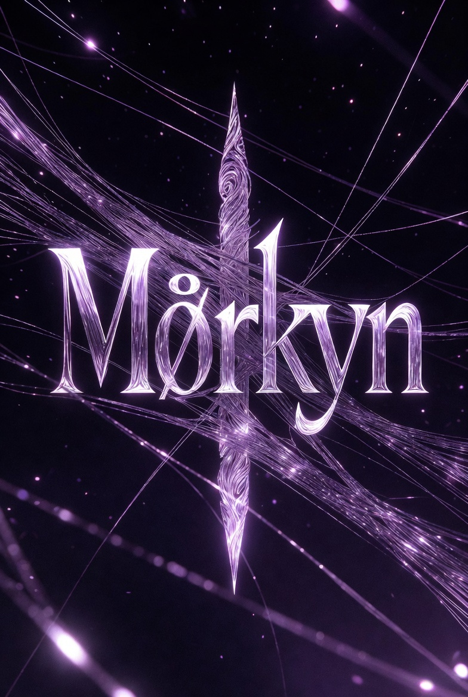
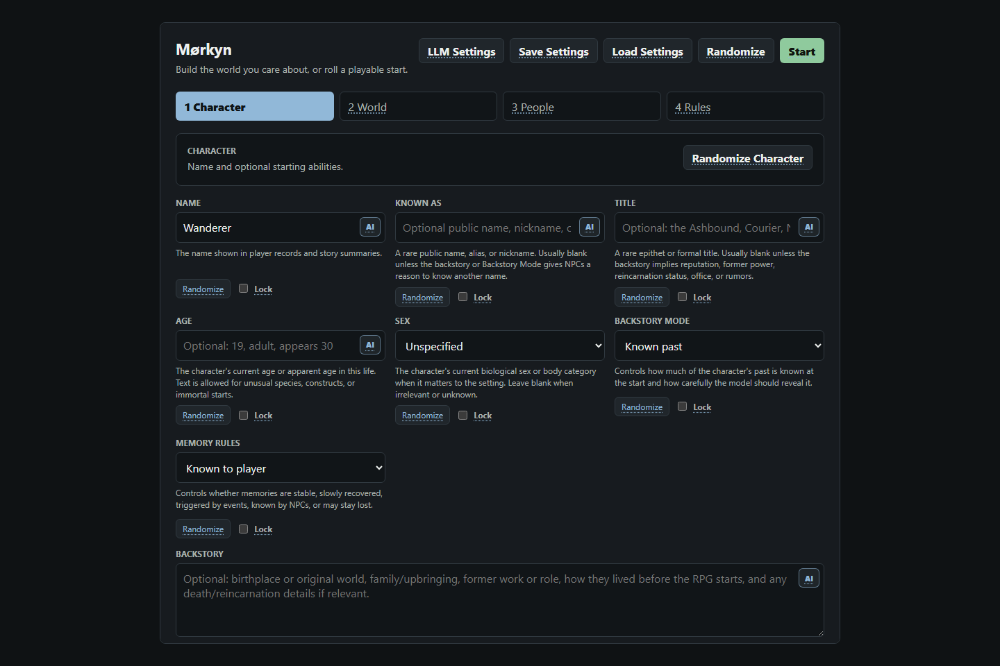
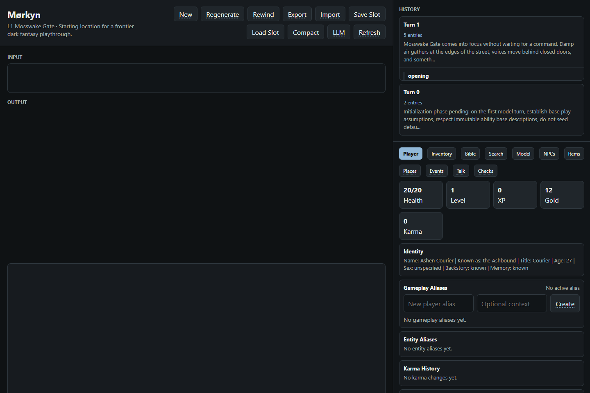
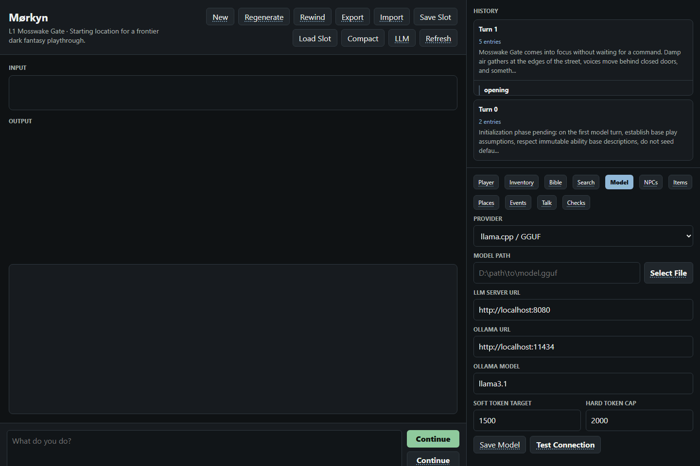
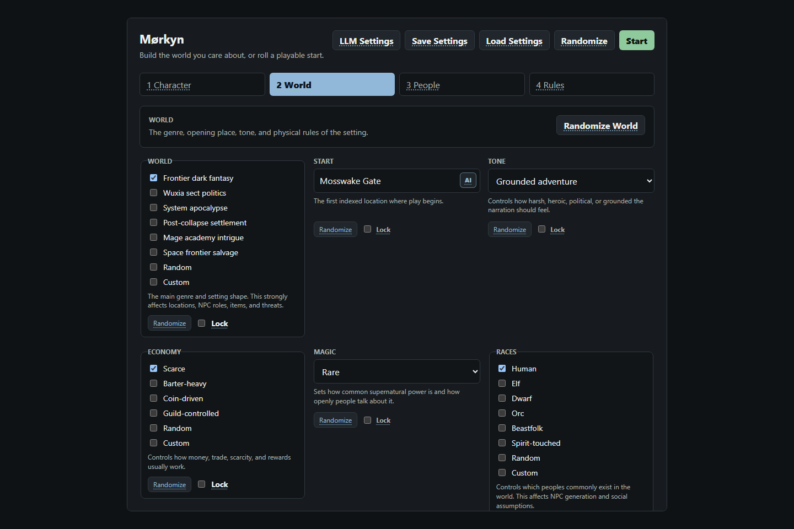
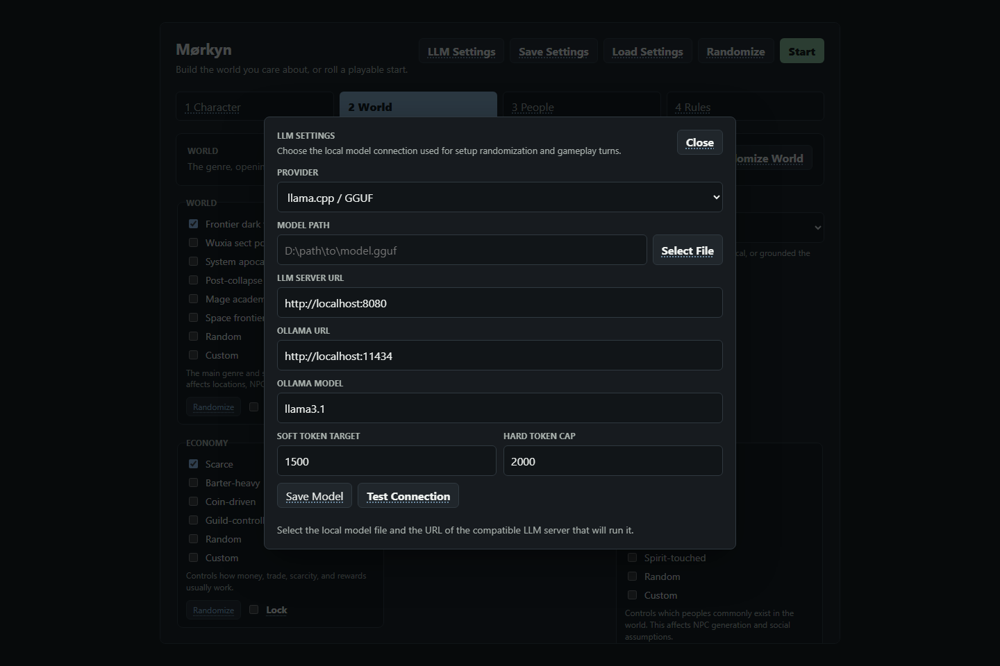
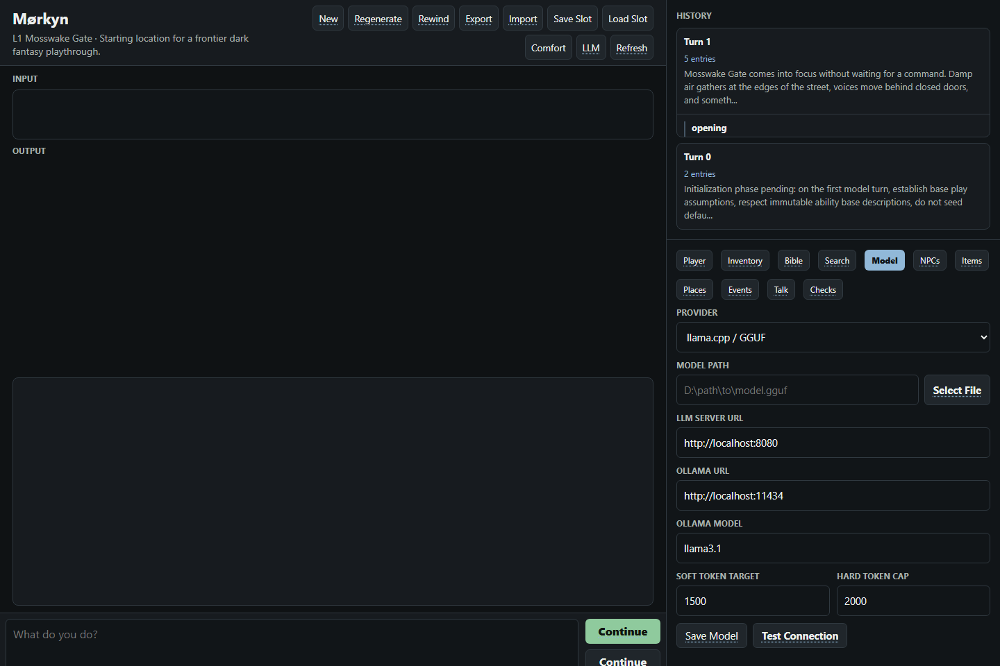

# Mørkyn

<p align="center">
  
</p>

**Version `0.9.1-wip`** · work-in-progress on the 0.9 line. Last stable: [`0.9.0`](https://github.com/Stelliro/Morkyn/releases/tag/v0.9.0).

**Mørkyn** is a local-first browser RPG. A local LLM narrates turns and proposes structured world changes, while SQLite remains the source of truth for the player, inventory, NPCs, events, summaries, and long-running continuity.

It is still pre-1.0 software, but it has enough systems to be a playable prototype and a solid base for long playthroughs.

## Download

This drop is **[`v0.9.1-wip`](https://github.com/Stelliro/Morkyn/releases/tag/v0.9.1-wip)**. One file, empty folder, run it. The launcher clones the repo, builds a private `.venv`, installs dependencies, and starts the game.

| OS | File | Download |
| --- | --- | --- |
| **Windows** | `start.bat` | **[Download start.bat](https://github.com/Stelliro/Morkyn/releases/download/v0.9.1-wip/start.bat)** — double-click |
| **Linux** | `start.sh` | **[Download start.sh](https://github.com/Stelliro/Morkyn/releases/download/v0.9.1-wip/start.sh)** — `bash start.sh` |
| **macOS** | `start.sh` | **[Download start.sh](https://github.com/Stelliro/Morkyn/releases/download/v0.9.1-wip/start.sh)** — same script as Linux |

Release page (notes + both files): [**Mørkyn 0.9.1-wip**](https://github.com/Stelliro/Morkyn/releases/tag/v0.9.1-wip)

```text
Windows        double-click start.bat
Linux / macOS  bash start.sh
```

Later runs check GitHub and **ask before updating** — answer no and it starts the copy you already have. Offline, it skips the check. It never touches a checkout with uncommitted local changes.

| Flag | Effect |
| --- | --- |
| `--full` | also install `llama-cpp-python` (only for the built-in GGUF server) |
| `--update` | apply an available update without asking |
| `--no-update` | skip the update check entirely |
| `--help` | full usage |

Both scripts also work from inside an existing checkout — they detect it and skip the clone. Requires Git and Python 3.11+.

## Lore teaser — 100 turns on Mosswake Road

Dual-role stress run (**Player** + **GM** over real `apply_turn` / SQLite, no LLM hang):

| Turns | Errors | Wall time | Mean apply | Final XP | Places |
| ---: | ---: | ---: | ---: | ---: | ---: |
| **100** | **0** | **~4.9 s** | **~45 ms** | 135 | Gate · Alley · Yard · Toll · Clearing |

Story spine and excerpts: **[docs/showcase/100-turn-lore-teaser.md](docs/showcase/100-turn-lore-teaser.md)**  
Metrics JSON: [docs/showcase/100-turn-metrics.json](docs/showcase/100-turn-metrics.json)

```powershell
python benchmarks/run_dual_role_playtest.py
```

<p align="center">
  
</p>

## Interface

| Setup | Play | Model / context health |
| --- | --- | --- |
|  |  |  |

| World setup | LLM settings | Compact mode |
| --- | --- | --- |
|  |  |  |

Assets: [`Media/`](Media/).

## Already have the repo

```powershell
python -m pip install -r requirements.txt
```

Double-click (or run from the repo root):

```text
Morkyn.bat
```

That opens a **simple** pre-play menu. Click a row (or press its number), then **Play**. Prefs save under `data/launcher_prefs.json`.

| Click / key | Action |
| --- | --- |
| **Play** / `1` | Start |
| **Where** / `2` | Cycle local / LAN / VPN |
| **Engine** / `3` | Cycle ollama / llama_cpp / cloud API |
| **Pipeline** / `4` | Toggle narration pipeline |
| **Advanced** / `9` | Full Gatehouse board |
| **Quit** / `0` | Exit |

Skip the menu:

```text
Morkyn.bat local
Morkyn.bat lan
Morkyn.bat vpn 8088
Morkyn.bat play
```

Compatibility shims: `start_ai_rpg.bat` / `start_ai_rpg.ps1` still call `Morkyn.*`.

## Repository layout

```text
Morkyn/
├── start.bat / start.sh      # one-file launchers (Windows / Linux+macOS) — also GitHub release assets
├── Morkyn.bat / Morkyn.ps1   # in-repo launcher (keep in root)
├── start_ai_rpg.*            # compatibility shims
├── README.md / CHANGELOG.md / LICENSE.md / PRIVACY_POLICY.md
├── CODEBASE_INDEX.md         # architecture map for contributors / agents
├── requirements.txt
├── .env.example
├── app/                      # FastAPI backend
├── static/                   # browser UI (no build step)
├── Media/                    # logo, key art, screenshots
├── content/                  # built-in content packs
├── docs/                     # design notes (APIs, pipeline, DSL, metrics)
├── tools/                    # smokes, screenshots, playtest helpers
├── tests/                    # regression + unit tests
├── benchmarks/               # dual-role / long-run harnesses
└── data/                     # local runtime only (gitignored)
```

## Highlights

- FastAPI backend with a plain browser UI (no frontend build step).
- SQLite world state stored locally under `data/`.
- Local LLM support (Ollama / llama.cpp) and optional OpenAI-compatible cloud APIs.
- Character and world setup, action-focused turn context, deterministic NPC combat profiles.
- Hierarchical memory consolidation, token budget guard, campaign save slots.
- Context health panel, compact mode, entity codes, visual history, World Bible, rewind.
- Local-only, LAN/phone, and trusted VPN launch modes.
- Optional adaptive narration pipeline and agent bridge endpoints.
- Optional **local character art** via Forge / A1111 (primary) — ComfyUI hooks exist but are **not fully verified yet**.

### New in 0.9.1-wip

- **Venues show in the play UI.** Shops on this square render as chips with open/closed state and a way out.
- **Inspect no longer duplicates the thing you looked at.** Looking at the seed in your hand does not mint two more.
- **Inventory quantity is on the row.** Name + count; the rest of the item lives in a hover overlay.
- **World staffing follows the setting.** A docking bay no longer hires bargemen; an unset tech dropdown no longer tells a starship it is iron age; an open-magic world is no longer told magic is rare.
- **Naming, recall, and answer-acts** are server contracts: if you ask who the letter is for, the world has to say the name.

### Also in 0.9.0

- **Server-rolled dice.** The model writes a band (`small`, `large`, …); the app rolls the amount and scales it by level, difficulty, and growth settings. Every roll is audited in `dice_rolls`. Deterministic seeding means a rewind reproduces the same dice.
- **Content packs.** JSON files that add, retune, or remove skills, powers, items, and tables with no code changes. Drop one in `data/packs/`.
- **Venues.** Shops, inns, forges and temples are real places you walk into and back out of, with opening hours against the world clock, a keeper who stays the same person, and a settlement-size rule so a hamlet has no apothecary. See [docs/Venues.md](docs/Venues.md).
- **Continuity fixes.** Movement, narrative person, and NPC identity are now server contracts with deterministic repair rather than things the model is asked to remember.
- **Danger model.** Travel, wait, and rest risk accounts for stats, skills, wounds, fatigue, load, terrain, weather, and time of day.

## Local images (ForgeSD / ComfyUI)

Optional portraits and full-body art use a **local** image backend. Nothing runs until you set a provider in **LLM Settings → Images**.

| Backend | Status in Mørkyn |
| --- | --- |
| **Forge / ForgeSD** | **Supported path** — actively used and tested |
| **ComfyUI** | **Wired but unverified** — config tabs + launch/helpers exist; end-to-end generation has **not** been fully signed off by the project owner yet. It will be marked verified once the owner or a contributor confirms it. |

Docs: [docs/ConnectImages.md](docs/ConnectImages.md) · [docs/CharacterPortrait.md](docs/CharacterPortrait.md)

Repos / face-lock extras (InstantID, FaceID, IPAdapter Plus, InsightFace wheel) are listed under **LLM Settings → Images → Installs**. Install buttons stay **blocked** until the matching Forge or Comfy install root is set; already-present pieces show **Installed**.

## Privacy

Mørkyn is **local-first**: no analytics, no metrics, no automatic phone-home.

- Policy: [PRIVACY_POLICY.md](PRIVACY_POLICY.md) (also in-app **Privacy** and `/privacy`)
- Optional **Updates** only contact **GitHub** when you check/apply/rollback
- If **uBlock Origin** (or similar) blocks `/static/app.js`, the app shows a blocker notice — allow `127.0.0.1` / localhost for this tab

## Model setup

### Local (GGUF / Ollama)

```powershell
$env:AI_RPG_GGUF_MODEL="D:\path\to\model.gguf"
# or Ollama:
$env:AI_RPG_MODEL_PROVIDER="ollama"
$env:OLLAMA_MODEL="qwen3:8b"
```

### Cloud / agents (xAI Grok, OpenAI, any OpenAI-compatible gateway)

```powershell
$env:AI_RPG_MODEL_PROVIDER="openai"
$env:AI_RPG_API_BASE_URL="https://api.x.ai/v1"
$env:AI_RPG_API_MODEL="grok-4.5"
$env:XAI_API_KEY="xai-..."
```

Or use **LLM Settings** in the UI → provider *Cloud / agent API*. See [docs/ConnectAPIs.md](docs/ConnectAPIs.md).

External agents can drive play via:

```text
POST /api/agent/turn   { "text": "player action" }
GET  /api/agent/state
GET  /api/agent/health
```

Optional lock: `AI_RPG_AGENT_TOKEN`.

Useful overrides:

```powershell
$env:AI_RPG_LLAMA_CPP_CONTEXT="32768"   # keep >= 12288: the full system contract is ~9.1k tokens
$env:AI_RPG_LLAMA_CPP_GPU_LAYERS="-1"
$env:AI_RPG_MAX_RESPONSE_TOKENS="1500"
$env:AI_RPG_RESPONSE_HARD_CAP_TOKENS="2000"
$env:AI_RPG_FAST_VERIFICATION="1"
$env:AI_RPG_MEMORY_KEEP_SUMMARIES="12"
$env:AI_RPG_MEMORY_MAX_FACTS="200"
$env:AI_RPG_GM_OFFSCREEN_INTERVAL="8"
```

## Local 8B turn times

Measured on **Ollama `qwen3:8b`** (Q4_K_M, 32k context, thinking off). Times are wall-clock for a full turn pipeline on the machine under test.

| Step | Time |
| --- | ---: |
| Opening scene | ~**1–2 min** (pipeline on; quality pass improved) |
| Typical player turn | ~**1–3.5 min** |
| Dual-role 100-turn backend (no LLM) | ~**5 s** total |

Full tables: [`docs/turn-metrics/`](docs/turn-metrics/). Re-run:

```powershell
python tools/playtest_timed_turns.py
python benchmarks/run_dual_role_playtest.py
```

## Debug (per turn)

Each completed turn has a collapsed **Debug** row under the narration:

| Action | What it does |
| --- | --- |
| Click **Debug** | Expand / collapse summary (check status, usage phases, path) |
| **Copy summary** | Clipboard: short human-readable dump |
| **Copy JSON** | Clipboard: structured debug bundle |
| **Copy path** | Clipboard: local `data/model_traces/…` path |
| **View file** | Loads the full trace JSON in-panel via `/api/debug-trace` |

Trace files are written under `data/model_traces/` (gitignored). The play view stays clean until you expand a turn.

## Development

```powershell
python tests/behavior_test.py
python tests/test_narration_pipeline.py
python benchmarks/run_dual_role_playtest.py
```

## Docs and license

| Doc | Link |
| --- | --- |
| Architecture | [CODEBASE_INDEX.md](CODEBASE_INDEX.md) |
| Docs index | [docs/README.md](docs/README.md) |
| Changelog | [CHANGELOG.md](CHANGELOG.md) |
| Privacy | [PRIVACY_POLICY.md](PRIVACY_POLICY.md) |
| License | [LICENSE.md](LICENSE.md) (PolyForm Noncommercial 1.0.0) |

| Field | Value |
| --- | --- |
| Product | **Mørkyn** |
| Version | **0.9.1-wip** |
| GitHub | https://github.com/Stelliro/Morkyn |

Formerly published as AI RPG Consistency Prototype (`ai-rpg-consistency-prototype`).
